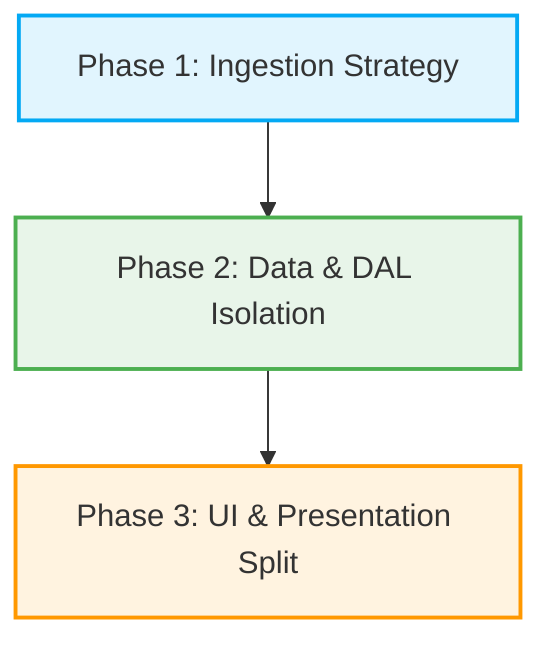

# :material/architecture: Seaplane Ops Dashboard - Refactoring & Code Architecture Plan

This document outlines the architectural recommendations to reorganize the Seaplane Operator Schedule Dashboard into a clean, testable, and highly maintainable production codebase. 

---

## :material/folder: 1. Proposed Project Directory Tree

By introducing a modular structure inside a `src/` directory, we cleanly separate the application's concerns (Data Access, ETL Parsing, Business Logic, and UI).

```
spln_operator_schedules/
├── .streamlit/
│   └── config.toml           # Streamlit theme/configs
├── src/
│   ├── config.py             # Global constants, color palettes, and schemas
│   ├── database/             # Data Access Layer (DAL)
│   │   ├── __init__.py
│   │   ├── connection.py     # SQLite connection pooling & context managers
│   │   └── repositories.py   # Explicit CRUD operations (Movements, Registrations)
│   ├── processors/           # Strategy pattern for ETL parsers
│   │   ├── __init__.py       # Auto-dispatcher factory
│   │   ├── base.py           # Abstract base class / protocol definition
│   │   ├── maldivian.py      # Maldivian extraction logic
│   │   ├── manta.py          # Manta extraction logic
│   │   ├── tma.py            # TMA extraction logic
│   │   └── villa.py          # Villa PDF extraction logic
│   ├── analytics/            # Pure data computation (No Streamlit imports)
│   │   ├── __init__.py
│   │   ├── metrics.py        # Pandas/NumPy aggregations & YoY calculations
│   │   └── charts.py         # Pure Plotly figure builders (returns go.Figure)
│   └── ui/                   # Streamlit View/Presentation Layer
│       ├── __init__.py
│       ├── components.py     # Reusable UI cards, tables, and dialogs
│       ├── tab_today.py      # View: Today's Operations
│       ├── tab_history.py    # View: Historical Analysis
│       └── view_ingestion.py # View: Ingestion Wizard
├── tests/                    # Offline Unit & Integration Tests
│   ├── test_processors.py    # Offline parsing validation
│   └── test_metrics.py       # Math & YoY calculation verification
├── main.py                   # Main routing entry point (slim bootstrap file)
├── requirements.txt
└── README.md
```

---

## :material/build: 2. Core Architectural Pillars

### A. Separation of Concerns (SoC) - Decoupling Streamlit
> [!IMPORTANT]
> Mixing UI code (`st.write`, `st.plotly_chart`) with analytical business logic makes the backend impossible to unit test without running the Streamlit server.

* **Business Logic (`src/analytics/metrics.py`)**:
  Contains raw NumPy/Pandas data-frame transformations. These functions accept raw Pandas DataFrames and return standard DataFrames or dictionary metrics. They have **zero** Streamlit imports.
* **Visualization Layer (`src/analytics/charts.py`)**:
  Configures and returns Plotly `go.Figure` or `px` objects. This allows visual elements to be tested independently of Streamlit.
* **Presentation Layer (`src/ui/`)**:
  Responsible exclusively for rendering page grids, reading inputs (`st.toggle`, `st.date_input`), and outputting results (`st.plotly_chart`).

### B. Strategy Pattern for ETL Operators
> [!TIP]
> The current monolithic `processors.py` dispatcher is highly coupled. Adding a new operator or editing an existing extraction format introduces regression risks for all other operators.

* **Base Interface (`src/processors/base.py`)**:
  Defines an abstract base class or Python Protocol enforcing standard structure:
  ```python
  from abc import ABC, abstractmethod
  import pandas as pd

  class BaseScheduleProcessor(ABC):
      @abstractmethod
      def extract(self, file_bytes) -> pd.DataFrame:
          """Extract raw data from source file."""
          pass

      @abstractmethod
      def normalize(self, df: pd.DataFrame) -> pd.DataFrame:
          """Normalize raw data into the standardized schema."""
          pass
  ```
* **Registry Dispatcher (`src/processors/__init__.py`)**:
  Maps file name patterns to their corresponding strategy implementation. When a file is uploaded, the dispatcher selects and instantiates the correct subclass dynamically.

### C. Clean Data Access Layer (DAL)
> [!NOTE]
> Database access is currently mixed. A clean DAL makes the future Supabase or PostgreSQL migration seamless.

* **Connection Lifecycle (`src/database/connection.py`)**:
  Implements context managers to open and safely close connections, preventing locking bugs and transaction leaks during high-performance runs.
* **Repository Pattern (`src/database/repositories.py`)**:
  Isolates SQL execution. UI elements and backend engines never execute raw SQL; instead, they call high-level repository interfaces:
  ```python
  movement_repo.save_movements(df)
  movement_repo.delete_by_filename(filename)
  ```

---

## :material/checklist: 3. Phased Implementation Plan

To prevent runtime breakage during refactoring, changes should be introduced in three sequential, verifiable stages:



### Phase 1: Ingestion & Processors Strategy (Offline Safe)
1. Set up the `src/processors/` subdirectory.
2. Port each operator parser out of the monolithic `processors.py` into separate strategies.
3. Establish unit tests in `tests/test_processors.py` using static excel/pdf fixtures to verify that output schemas remain identical.

### Phase 2: Isolation of Data & DAL
1. Relocate the database layer to `src/database/` and implement the context-managed database connection pool.
2. Abstract all database queries into repository functions.
3. Relocate global styling, schemas, and color palette mappings to a single configurations hub `src/config.py`.

### Phase 3: Analytics & UI Split
1. Move data aggregations and Plotly configurations to the `src/analytics/` package.
2. Break down `main.py` into isolated Streamlit routing views in `src/ui/`.
3. Bootstrap `main.py` at the root as a simple routing shell that imports and mounts the views.
